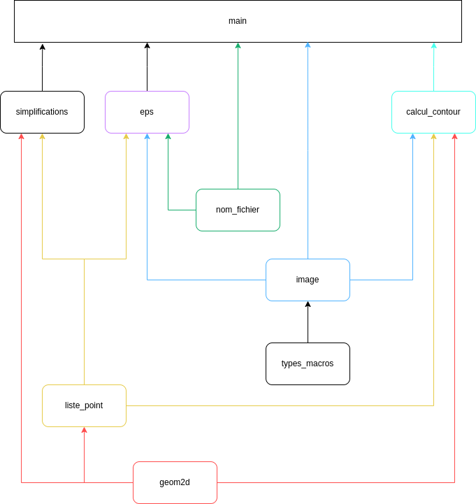
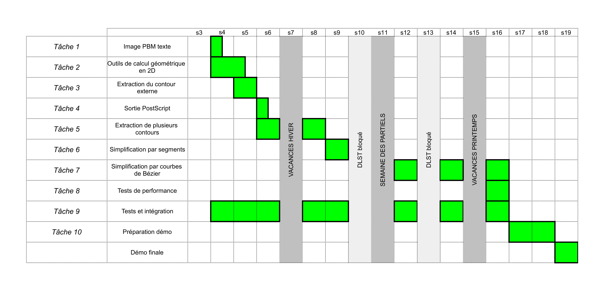
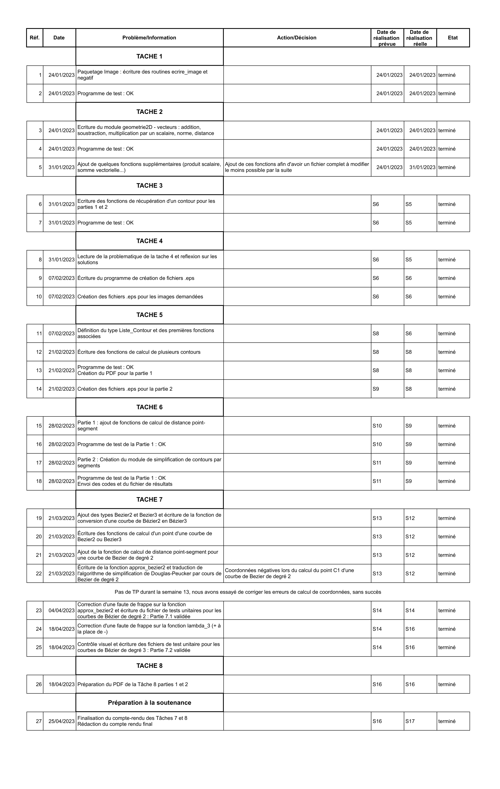

# Projet logiciel : Vectorisation et simplification d'images bitmap

## Structure du projet

### Fichiers

- `README.md` : ce fichier
- `Makefile` : fichier de compilation

### Répertoires

- `Tache_n` : les fichiers sauvegardés à la fin de chaque tache
- `Version_finale` : la version finale de ce projet
- `Readme_files` : les fichiers utilisés pour la création du Readme
- `Images_Test` : Les images créés durant le projet pour les tests
- `IMAGES` : Les images fournies
- `Sorties_EPS` : Les fichiers EPS générés par les programmes
- `Sorties_contours` : Les fichiers contours générés par les programmes

### Structure des modules

- `main` : programme principal qui extrait le contour d'une image donnée puis le simplifie et produit une sortie au format eps
- `image` : module de manipulation d'images bitmap
- `geom2D` : module de manipulation de vecteurs et de points
- `calcul_contour` : module de calculs de contour
- `nom_fichier` : module de manipulation de nom et de chemins de fichier
- `simplification` : module de simplification de contours qui contient les trois méthodes : par segments, courbes de bézier de degré 2 et 3
- `test_X` : programme de test associé au module X
- `Makefile` : fichier de compilation
- `scripts_bash` : scripts utilisés pour faciliter la soutenance

## Processus de construction du projet

### Tâche 1

#### Paquetage Image

- **Écriture de la routine `ecrire_image`**
  Ici on a opté pour un simple parcours de l'image avec une double boucle 'for'.
  Pour rendre l'affichage plus lisible, on a décidé de ne pas représenter le noir et le blanc chacun par un symbole différent. À la place on affiche un espace avec un fond coloré grâce aux séquences d'échappement ANSI.
- **Écriture de la routine `negatif_image`**
  Pour ne pas avoir d'effets de bord, on déclare une nouvelle image (neg_I) qui sera celle que l'on modifiera et retournera. On parcours l'image de départ (I) avec une double boucle 'for' et on inverse (avec l'opérateur 'not' (!)) la valeur de la case que l'on assigne a la case correspondante de 'neg_I'.
- **Écriture du programme de test `test_image.c`**
  On a choisi de tester les deux fonctions précédentes en créant une image de test (image_test) et en l'affichant. On affiche ensuite l'image négative (neg_I) de cette image.
- **Ajouts au fichier `Makefile`**
  On ajoute les règles de compilation nécessaires pour compiler le programme `test_image`.
- **Exécution du programme de test et vérification des résultats.**

### Tâche 2

#### Paquetage Geom2D

- **Définition des types `Point` et `Vecteur`**
- **Écriture de nombreuses routines** qui correspondent à des opérations mathématiques sur les points et les vecteurs
- **Écriture du programme de test `test_geom2D.c`**
<!--TODO : revoir le fichier de test et l'expliquer-->
- **Ajouts au fichier `Makefile`**
  On ajoute les règles de compilation nécessaires pour compiler le module `test_geom2D`.
- **Exécution du programme de test et vérification des résultats.**

### Tâche 3

#### Partie 1

##### Paquetage calcul_contour

- **Ecriture de la procédure `calcul_contour`**
  On a choisi de faire une fonction qui prend en paramètre une image et le point de départ du contour et qui affiche à l'écran les points du contour.
  La procédure utilise un robot définit par sa position et son orientation.
  On a donc créé le type enuméré `orientation` qui contient 4 valeurs :

  - Nord
  - Est
  - Sud
  - Ouest

  On place le robot au point de départ puis tant qu'il ne revient pas au point de départ, on le fait se réorienter et avancer. On affiche le position du robot a chaque itération de la boucle.
  Il nous a fallu des fonctions intermédiaires :

  - `avancer`
    La fonction prend en paramètre un point et une orientation et renvoie le point obtenu en avancant tout droit avec cette orientation.
    On utilise un switch pour incrémenter ou décrementer la bonne coordonée dépendamment de l'orientation.
  - `tourner`
    La fonction prend en paramètre une orientation et un booleen qui décrit si il faut tourner a droite (vrai) ou a gauche (faux)
  - `trouver_pixel_départ`
    La fonction prend en paramètre une image et renvoie le premier pixel noir qu'elle trouve.
    Elle parcours l'image dans le sens de lecture (de gauche à droite et de haut en bas) avec un double for et retourne la position du premier pixel noir. Sinon, elle retourne (0;0).
  - `get_pixel_relatif`
    La fonction prend en paramètre une image, un point, une orientation et une direction (relative) et renvoie la valeur du pixel dans cette direction.
    On a donc du définir le type `direction` qui contient 4 valeurs:

    - Avant_gauche
    - Avant_droit
    - Arriere_gauche
    - Arriere_droit

  - `nouvelle_orientation`
    La fonction prend en paramètre une image, une position et une orientation et renvoie la nouvelle orientation du robot.
    On utilise la fonction `get_pixel_relatif` pour vérifier la couleur des pixels environnants. On calcule alors la nouvelle orientation avec la fonction `tourner`.

- **Ecriture du programme de test `test_calcul_contour.c`**
  La fonction `calcul_contour` est appelée sur l'image dont le nom est passé en argument pour que l'on puisse observer le résultat obtenu.
- **Ajouts au fichier `Makefile`**
  On ajoute les règles de compilation nécessaires pour compiler le programme `test_calcul_contour`.
- **Exécution du programme de test et vérification des résultats.**

#### Partie 2

##### Paquetage calcul_contour

Pour passer d'une fonction qui écrivait à l'écran le contour à une qui retournait une liste de point, on a d'abord changé le prototype de la fonction de :

```c
void calcul_contour(Image I, Point p_depart);
```

à :

```c
Liste_Point calcul_contour(Image I, Point p_depart);
```

Il a fallut aussi créé la liste de point que l'on allait retourner. Ensuite, au lieu dafficher à l'écran avec :

```c
printf("(%.0f,%.0f) ", p_robot.x, p_robot.y);
```

On ajoutait le point à la liste de cette façon :
  
```c
L = ajouter_element_liste_Point(L,p_robot);
```

On a aussi ajouté au paquetage liste_point la procédure :

```c
void ecrire_contour_fichier(Liste_Point L, char* nom_fichier);
```

Cette procédure parcours la liste de points donnée et ecrit dans un fichier `.contour` chacun des points.

Il a après fallu modifier légèrement le fichier test contour pour s'adapter à ses changements

### Tâche 4

#### Paquetage eps

- **Écriture de la routine `ecrire_fichier_eps`**
  La fonction prend en paramètre une image, ses dimensions (largeur et hauteur), le nom du fichier .eps dans lequel l'image doit être écrite au format Post Script Encapsulé, ainsi que le type de dessin (`STROKE` ou `FILL`).
  L'image y est écrite en parcourant, cellule par cellule, chaque point du contour précédemment extrait.

- **Ecriture du programme de test `test_eps.c`** Ce programme prend en argument une image et un mode de tracé ("stroke" ou "fill"). À partir d'un fichier image.pbm, ce programme crée le fichier image_\<mode\>.eps représentant la même image avec le mode de tracé choisi.

- **Ajouts au fichier `Makefile`**
  On ajoute les règles de compilation nécessaires pour compiler le programme `test_calcul_contour`.
- **Exécution du programme de test et vérification des résultats.**

### Tâche 5

#### Partie 1

Aucun fichier ajouté. Ajout du type Liste_Contour dans liste_point.h et des 5 dernières fonctions.
Modification de calcul_contour.c avec les Liste_Contour.
Mise à jour du test_contour.c

#### Partie 2

Mise à jour de ecrire_fichier_eps dans eps.c. Mise à jour de test_eps avec le nouveau type.
Calcul de nb_contour et nb_segment jsp où.

**FAIRE MANUEL POUR TACHE 5**

## Manuel d'utilisation

### Compilation

Pour compiler le projet, il suffit de se placer dans le dossier `Version_finale` et d'exécuter la commande `make`.

### Dépendances



### Exécution

Pour simplifier une image il faut appeler la commande :

> ./main <nom_de_l'image_de_départ> <distance_seuil> <degré>

avec **<distance_seuil>** un `double` positif ou nul et **<degré>** :

- 1 pour simplification par segment
- 2 pour simplification par courbes de bézier de degré 2
- 3 pour simplification par courbes de bézier de degré 3

## Suivi du projet

### Diagramme de Gantt



### Journal de bord



## Auteurs

- **Yann Letourneur**
- **Gwendal Trehin**
