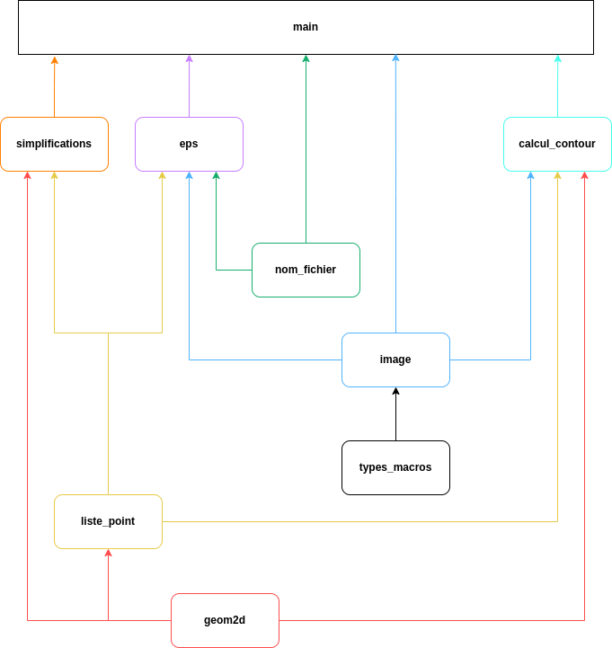

# Projet logiciel : Vectorisation et simplification d'images bitmap

## Structure du projet

### Fichiers

- `README.md` : ce fichier
- `Makefile` : fichier de compilation

### Répertoires

- `Tache_n` : les fichiers sauvegardés à la fin de chaque tache
- `Version_finale` : la version finale de ce projet
- `Readme_files` : les fichiers utilisés pour la création du Readme
- `Images_Test` : Les images créés durant le projet pour les tests
- `IMAGES` : Les images fournies
- `Sorties_EPS` : Les fichiers EPS générés par les programmes
- `Sorties_contours` : Les fichiers contours générés par les programmes

### Structure des modules

- `main` : programme principal qui extrait le contour d'une image donnée puis le simplifie et produit une sortie au format eps
- `image` : module de manipulation d'images bitmap
- `geom2D` : module de manipulation de vecteurs et de points
- `calcul_contour` : module de calculs de contour
- `nom_fichier` : module de manipulation de nom et de chemins de fichier
- `simplification` : module de simplification de contours qui contient les trois méthodes : par segments, courbes de bézier de degré 2 et 3
- `test_X` : programme de test associé au module X
- `Makefile` : fichier de compilation
- `scripts_bash` : scripts utilisés pour faciliter la soutenance

## Processus de contruction du projet

### Tâche 1

#### Paquetage Image

- **Écriture de la routine `ecrire_image`**
  Ici on a opté pour un simple parcours de l'image avec une double boucle 'for'.
  Pour rendre l'affichage plus lisible, on a décidé de ne pas représenter le noir et le blanc chacun par un symbole différent. À la place on affiche un espace avec un fond coloré grâce aux séquences d'échappement ANSI.
- **Écriture de la routine `negatif_image`**
  Pour ne pas avoir d'effets de bord, on déclare une nouvelle image (neg_I) qui sera celle que l'on modifiera et qu'on retournera. On parcours l'image de départ (I) avec une double boucle 'for' et on inverse (avec l'opérateur not (!)) la valeur de la case que l'on assigne a la case correspondante de 'neg_I'.
- **Écriture du programme de test `test_image.c`**
  On a choisi de tester les deux fonctions précédentes en créant une image de test (image_test) et en l'affichant. On affiche ensuite l'image négative (neg_I) de cette image.
- **Ajouts au fichier `Makefile`**
  On ajoute les règles de compilation nécessaires pour compiler le programme `test_image`.
- **Exécution du programme de test et vérification des résultats**

### Tâche 2

#### Paquetage Geom2D

- Définition des types `Point` et `Vecteur`
- Écriture de nombreuses routines qui correspondent à des opérations mathématiques sur les points et les vecteurs
- Écriture du programme de test `test_geom2D.c`
<!--TODO : revoir le fichier de test et l'expliquer-->
- Ajouts au fichier `Makefile`
  On ajoute les règles de compilation nécessaires pour compiler le module `test_geom2D`.
- Exécution du programme de test et vérification des résultats

### Tâche 3

#### Partie 1

##### Paquetage calcul_contour

- **Ecriture de la procédure calcul contour**
  On a choisi de faire une fonction qui prend en paramètre une image et le point de départ du contour et qui affiche à l'écran les points du contour.
  La procédure utilise un robot définit par sa position et son orientation.
  On a donc créé le type enuméré **orientation** qui contient 4 valeurs :

  - Nord
  - Est
  - Sud
  - Ouest

  On place le robot au point de départ puis tant qu'il ne revient pas au point de départ, on le fait se réorienter et avancer. On affiche le position du robot a chaque boucle.
  Il nous a fallu des fonctions intermédiaires :

  - **avancer**
    La fonction prend en paramètre un point et une orientation et renvoie le point obtenu en avancant tout droit avec cette orientation.
    On utilise un switch pour incrémenter ou décrementer la bonne coordonée dépendamment de l'orientation.
  - **tourner**
    La fonction prend en paramètre une orientation et un booleen qui décrit si il faut tourner a droite (vrai) ou a gauche (faux)
  - **trouver_pixel_départ**
    La fonction prend en paramètre une image et renvoie le premier pixel noir qu'elle trouve.
    Elle parcours l'image dans le sens de lecture (de gauche à droite et de haut en bas) avec un double for et retourne la positiondu pixel si il est noir.
  - **get_pixel_relatif**
    La fonction prend en paramètre une image, un point, une orientation et une direction(relative) et renvoie la valeur du pixel dans cette direction.
    On a donc du définir le type **direction** qui contient 4 valeurs:

    - Avant_gauche
    - Avant_droit
    - Arriere_gauche
    - Arriere_droit
  - **nouvelle_orientation**
    La fonction prend en paramètre une image, une position et une orientation et renvoie la nouvelle orientation du robot.
    On utilise la fonction **get_pixel_relatif** pour vérifier la couleur des pixels environnant. On calcule alors la nouvelle orientation avec la fonction tourner.

- **Ecriture du programme de test `test_calcul_contour.c`**
  La fonction **calcul_contour** est appelée sur l'image dont le nom est passé en argument pour que l'on puisse observer le résultat obtenu
- **Ajouts au fichier `Makefile`**
  On ajoute les règles de compilation nécessaires pour compiler le programme `test_calcul_contour`.
- **Exécution du programme de test et vérification des résultats**

## Manuel d'utilisation

### Compilation

Pour compiler le projet, il suffit de se placer dans le dossier `Version_finale` et d'exécuter la commande `make`.

### Dépendances

### Exécution

## Suivi du projet

### Diagramme de Gantt

### Journal de bord

| Réf. | Date        | Problème/Information                                                                                                                                                 | Action/Décision                                                                                  | Date de réalisation prévue | Date de réalisation réelle | Etat    |
| ---- | ----------- | -------------------------------------------------------------------------------------------------------------------------------------------------------------------- | ------------------------------------------------------------------------------------------------ | -------------------------- | -------------------------- | ------- |
|      | **TACHE 1** |                                                                                                                                                                      |                                                                                                  |                            |
| 1    | 24/01/2023  | Paquetage Image : écriture des routines ecrire_image et negatif                                                                                                      |                                                                                                  | 24/01/2023                 | 24/01/2023                 | terminé |
| 2    | 24/01/2023  | Programme de test : OK                                                                                                                                               |                                                                                                  | 24/01/2023                 | 24/01/2023                 | terminé |
|      | **TACHE 2** |                                                                                                                                                                      |                                                                                                  |                            |
| 3    | 24/01/2023  | Ecriture du module geometrie2D - vecteurs : addition, soustraction, multiplication par un scalaire, norme, distance                                                  |                                                                                                  | 24/01/2023                 | 24/01/2023                 | terminé |
| 4    | 24/01/2023  | Programme de test : OK                                                                                                                                               |                                                                                                  | 24/01/2023                 | 24/01/2023                 | terminé |
| 5    | 31/01/2023  | Ajout de quelques fonctions supplémentaires (produit scalaire, somme vectorielle...)                                                                                 | Ajout de ces fonctions afin d'avoir un fichier complet à modifier le moins possible par la suite | 24/01/2023                 | 31/01/2023                 | terminé |
|      | **TACHE 3** |                                                                                                                                                                      |                                                                                                  |                            |
| 6    | 31/01/2023  | Ecriture des fonctions de récupération d'un contour pour les parties 1 et 2                                                                                          |                                                                                                  | S6                         | S5                         | terminé |
| 7    | 31/01/2023  | Programme de test : OK                                                                                                                                               |                                                                                                  | S6                         | S5                         | terminé |
|      | **TACHE 4** |                                                                                                                                                                      |                                                                                                  |                            |
| 8    | 31/01/2023  | Lecture de la problematique de la tache 4 et reflexion sur les solutions                                                                                             |                                                                                                  | S6                         | S5                         | terminé |
| 9    | 07/02/2023  | Écriture du programme de création de fichiers .eps                                                                                                                   |                                                                                                  | S6                         | S6                         | terminé |
| 10   | 07/02/2023  | Création des fichiers .eps pour les images demandées                                                                                                                 |                                                                                                  | S6                         | S6                         | terminé |
|      | **TACHE 5** |                                                                                                                                                                      |                                                                                                  |                            |
| 11   | 07/02/2023  | Définition du type Liste_Contour et des premières fonctions associées                                                                                                |                                                                                                  | S8                         | S6                         | terminé |
| 12   | 21/02/2023  | Écriture des fonctions de calcul de plusieurs contours                                                                                                               |                                                                                                  | S8                         | S8                         | terminé |
| 13   | 21/02/2023  | Programme de test : OK Création du PDF pour la partie 1                                                                                                              |                                                                                                  | S8                         | S8                         | terminé |
| 14   | 21/02/2023  | Création des fichiers .eps pour la partie 2                                                                                                                          |                                                                                                  | S9                         | S8                         | terminé |
|      | **TACHE 6** |                                                                                                                                                                      |                                                                                                  |                            |
| 15   | 28/02/2023  | Partie 1 : ajout de fonctions de calcul de distance point-segment                                                                                                    |                                                                                                  | S10                        | S9                         | terminé |
| 16   | 28/02/2023  | Programme de test de la Partie 1 : OK                                                                                                                                |                                                                                                  | S10                        | S9                         | terminé |
| 17   | 28/02/2023  | Partie 2 : Création du module de simplification de contours par segments                                                                                             |                                                                                                  | S11                        | S9                         | terminé |
| 18   | 28/02/2023  | Programme de test de la Partie 1 : OK Envoi des codes et du fichier de résultats                                                                                     |                                                                                                  | S11                        | S9                         | terminé |
|      | **TACHE 7** |                                                                                                                                                                      |                                                                                                  |                            |
| 19   | 21/03/2023  | Ajout des types Bezier2 et Bezier3 et écriture de la fonction de conversion d'une courbe de Bézier2 en Bézier3                                                       |                                                                                                  | S13                        | S12                        | terminé |
| 20   | 21/03/2023  | Écriture des fonctions de calcul d'un point d'une courbe de Bezier2 ou Bezier3                                                                                       |                                                                                                  | S13                        | S12                        | terminé |
| 21   | 21/03/2023  | Ajout de la fonction de calcul de distance point-segment pour une courbe de Bezier de degré 2                                                                        |                                                                                                  | S13                        | S12                        | terminé |
| 22   | 21/03/2023  | Écriture de la fonction approx_bezier2 et traduction de l'algorithme de simplification de Douglas-Peucker par cours de Bezier de degré 2                             | Coordonnées négatives lors du calcul du point C1 d'une courbe de Bezier de degré 2               | S13                        | S12                        | terminé |
|      |             | Pas de TP durant la semaine 13, nous avons essayé de corriger les erreurs de calcul de coordonnées, sans succès                                                      |                                                                                                  |                            |
| 23   | 04/04/2023  | Correction d'une faute de frappe sur la fonction approx_bezier2 et écriture du fichier de tests unitaires pour les courbes de Bézier de degré 2 : Partie 7.1 validée |                                                                                                  | S14                        | S14                        | terminé |
| 24   | 18/04/2023  | Correction d'une faute de frappe sur la fonction lambda_3 (+ à la place de -)                                                                                        |                                                                                                  | S14                        | S16                        | terminé |
| 25   | 18/04/2023  | Contrôle visuel et écriture des fichiers de test unitaire pour les courbes de Bézier de degré 3 : Partie 7.2 validée                                                 |                                                                                                  | S14                        | S16                        | terminé |
|      | **TACHE 8** |                                                                                                                                                                      |                                                                                                  |                            |
| 26   | 18/04/2023  | Préparation du PDF de la Tâche 8 parties 1 et 2                                                                                                                      |                                                                                                  | S16                        | S16                        | terminé |

## Auteurs

- **Yann Letourneur**
- **Gwendal Trehin**
